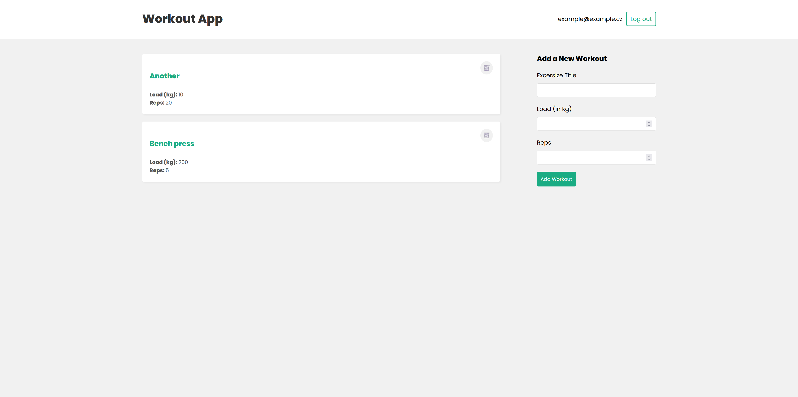
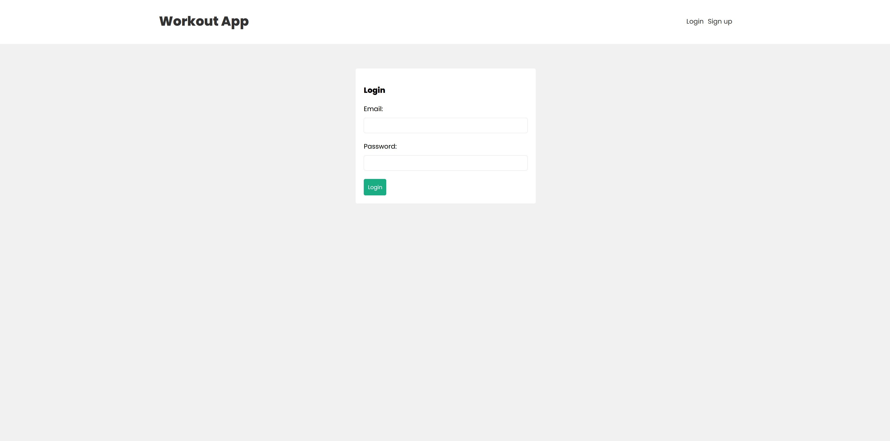

# Mern app

## App overview



## App Login page



A full-stack MERN application for planning exercises

## About the project

This is a full-stack MERN application that manages workouts. The app uses a Mongo database to store workouts and users and then display it using a React.

## 🛠️ Tech Stack

- **Frontend:** React, Redux  
- **Backend:** Node.js, Express.js  
- **Database:** MongoDB (cluster) with Mongoose  
- **Authentication & Security:** bcrypt, jsonwebtoken, validator

## Run Locally

Clone the project

```bash
  git clone https://github.com/midaxal/florian-mern
```

Go to the project directory

```bash
  cd florian-mern
```

Create an Atlas URI connection parameter in `florian-mern/backend/.env` with your Atlas URI:
```
MONGO_URI=mongodb+srv://<username>:<password>@mernapp.eyx1hnm.mongodb.net/?appName=MERNapp
```

## Run docker compose

```bash
  docker compose up --build
```

## Enjoy making your own workouts

Now, the app is running and you can make your own workout